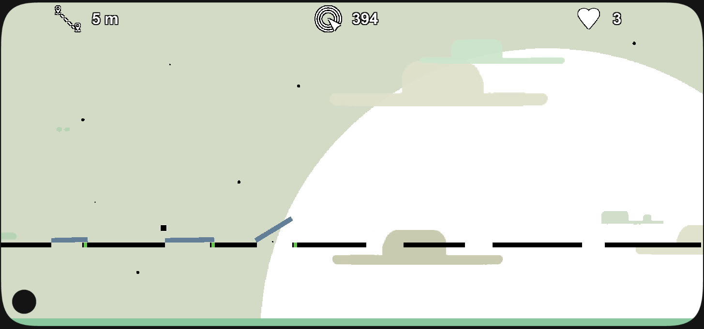

# Rise the Bar

  

<strong>A timing-based arcade platformer about building the bridge to the next island.</strong>

  
  
  

## About

**Rise the Bar** is a 2D side-scrolling score challenge. Hold to grow a bar, release it to bridge the gap, then keep the character moving forward. A bridge that is too short ends the run.

## Highlights

- **Simple precision mechanic:** Estimate the gap and build the right bridge length.
- **Continuous momentum:** The character keeps moving, making every decision immediate.
- **Score chasing:** Better placements and collected stars reward accurate runs.
- **Persistent play:** Audio and local save systems are included.

## Technical details

- **Engine:** Unity `6000.0.59f2`
- **Status:** Complete

## Run locally

1. Clone the repository.
2. Open it in Unity Hub with Unity `6000.0.59f2`.
3. Open a scene in `Assets/Scenes` and press Play.
